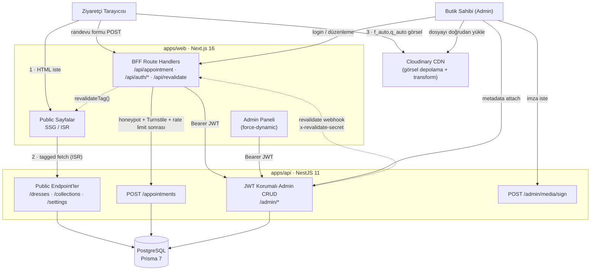

# Mimari (Architecture)

**Celine Gelinlik** — lüks, minimal, foto-öncelikli bir gelinlik butiği **showcase** sitesidir. E-ticaret, sepet veya fiyat listesi yoktur; birincil dönüşüm hedefi **atölye randevusu** ve **WhatsApp** iletişimidir. Bu doküman sistemin üst seviye mimarisini, uygulamaların birbiriyle nasıl konuştuğunu, render stratejisini ve veri akışlarını anlatır.

Şema ve endpoint detayları için [Veri Modeli](DATA-MODEL.md), barındırma ve ortam kurulumu için [Deployment](DEPLOYMENT.md) dokümanlarına bakın. İlgili dokümanlar: [Tasarım](DESIGN.md) · [Sayfalar](PAGES.md) · [Admin](ADMIN.md) · [SEO](SEO.md) · [Yol Haritası](ROADMAP.md).

---

## 1. Yüksek Seviye Mimari

Proje bir **pnpm workspaces monorepo**'dur. İki uygulama ve dokümantasyon aynı repo (`github.com/metinemredonmez/celine-wedding`) altında yaşar:

| Workspace | Teknoloji | Sorumluluk |
|---|---|---|
| **apps/web** | Next.js 16 (App Router) · TypeScript · Tailwind v4 · shadcn/ui · Framer Motion · next-intl | Herkese açık showcase sitesi + admin paneli (BFF katmanı dahil) |
| **apps/api** | NestJS 11 · Prisma 7 · PostgreSQL · argon2 + JWT · Swagger · Cloudinary | Public read endpoint'leri, randevu formu alımı, JWT korumalı admin CRUD |
| **docs/** | Markdown | Proje spesifikasyonu ve mimari dokümanları |

### Mimari duruş

Bu bir **showcase** olduğu için mimari kararlar buna göre şekillenir: sepet yok, fiyat birincil vatandaş değil, public tarafta kullanıcı hesabı yok. Bunun sonuçları:

- **Agresif statik public site** — SSG + ISR + tag tabanlı yeniden doğrulama (`revalidateTag`). Public tarafta hiçbir sayfa gerçekten request-başına render edilmez.
- **İnce, kimlik doğrulamalı admin** — App Router içinde yaşayan, NestJS ile konuşan bir admin uygulaması.
- **Görsel performansı 1 numaralı mühendislik kısıtı** — gelinlik fotoğrafları portre-ağırlıklı, yüksek çözünürlüklü ve *ürünün kendisidir*. Cloudinary CDN üzerinden AVIF-öncelikli sunum.

### İki yol: public read vs. admin write

Sistem iki temel yol üzerine kuruludur:

1. **Public read path (okuma yolu).** Ziyaretçi tarayıcısı → Next.js (build-time SSG / ISR) → NestJS public endpoint'leri → PostgreSQL. Görseller doğrudan Cloudinary CDN'den servis edilir. Bu yol salt-okunurdur, kimlik doğrulaması gerektirmez ve olabildiğince önbelleklenir.
2. **Admin write path (yazma yolu).** Butik sahibi admin panelinde bir düzenleme yapar → Next BFF route → NestJS JWT korumalı endpoint → PostgreSQL. Kayıt başarılı olduğunda NestJS, Next'e bir **revalidate webhook**'u gönderir; Next ilgili `revalidateTag`'leri tetikleyerek public SSG sayfalarını tazeler.

Ek olarak iki özel akış vardır: **randevu formu** (Next BFF route → spam kontrolü → NestJS) ve **görsel yükleme** (tarayıcı → doğrudan Cloudinary, imza NestJS'ten alınır).

---

## 2. Sistem Diyagramı



Diyagramdaki temel gözlemler:

- Görsel baytları **hiçbir zaman** Node process'inden (NestJS) geçmez; hem okuma (CDN) hem yükleme (doğrudan Cloudinary) tarayıcı ile CDN arasında olur.
- Public HTML build/ISR zamanında üretilir; ziyaretçi çoğunlukla önceden render edilmiş sayfayı alır.
- Admin yazma işlemi tamamlandığında önbellek tazeleme, düzenlemenin *nereden geldiğinden* bağımsız olarak NestJS → webhook zinciriyle yapılır.

---

## 3. Render Stratejisi

İçerik nadiren değişir (bir butik sezonda birkaç gelinlik ekler), bu yüzden public site **statik-öncelikli, admin düzenlemelerinde tag tabanlı yeniden doğrulamalı** kurgulanır. Aşağıdaki tablo `apps/web` route'larının stratejisini özetler:

| Route | Strateji | Neden |
|---|---|---|
| `/` (ana sayfa) | SSG + ISR (`revalidate: 3600`) | Hero + öne çıkanlar; güvenlik-ağı tazeleme |
| `/koleksiyonlar` | ISR `3600` | Küçük liste |
| `/koleksiyonlar/[slug]` | **SSG** (`generateStaticParams`) + tag revalidation | Tüm koleksiyonlar önceden build edilir; anlık LCP |
| `/modeller` | ISR `3600` | Galeri/filtre; filtreleme client-side veya `searchParams` ile |
| `/modeller/[dressSlug]` | **SSG** (`generateStaticParams`) + tag revalidation | Asıl dönüşüm sayfaları — LCP/SEO için mutlaka önceden render |
| `/ozel-dikim` | SSG + `/custom` singleton | Süreç anlatısı; nadir değişir |
| `/atolye` | SSG + `/about` singleton | Atölye/kurucu hikâyesi (eski `/hakkimizda`) |
| `/iletisim` | SSG + `/settings` verisi | İletişim + harita; ayarlar ISR ile tazelenir |
| `/randevu` | Statik kabuk + client form island | Form bir Client Component; sayfanın kendisi statik |
| `/gercek-gelinler` (Faz 2; MVP placeholder) | ISR `3600` | Gerçek gelin grid + alıntılar |
| `/galeri` (Faz 2) | ISR `3600` | Faz 2 galeri; lightbox dinamik import |
| `/admin/**` | Tamamen **dynamic** (`force-dynamic`, no cache) | Auth korumalı, canlı veri |

### Veri çekme (Server Components → NestJS)

Tüm public okumalar **tagged fetch** wrapper'ından geçer. Next.js 16'da `fetch` varsayılan olarak **önbelleksizdir** (Next 14'e göre kırıcı değişiklik), bu yüzden önbellekleme açıkça yapılır — bu proje için ideal, çünkü niyetli tag kullanımını zorunlu kılar.

```ts
// lib/api/client.ts
const API = process.env.NEST_API_URL!; // yalnızca sunucu tarafı env

export async function apiGet<T>(
  path: string,
  { tags = [], revalidate = 3600 }: { tags?: string[]; revalidate?: number } = {}
): Promise<T> {
  const res = await fetch(`${API}${path}`, {
    next: { tags, revalidate }, // Data Cache + tag invalidation'a opt-in
    headers: { Accept: "application/json" },
  });
  if (!res.ok) throw new Error(`API ${path} → ${res.status}`);
  return res.json();
}
```

```ts
// lib/api/dresses.ts
import { apiGet } from "./client";
import type { Dress } from "./types";

export const getDress = (slug: string) =>
  apiGet<Dress>(`/dresses/${slug}`, { tags: ["dresses", `dress:${slug}`] });

export const getDresses = () =>
  apiGet<Dress[]>(`/dresses`, { tags: ["dresses"] });

export const getDressSlugs = () =>
  apiGet<{ slug: string }[]>(`/dresses/slugs`, { tags: ["dresses"] });
```

```ts
// app/[locale]/(site)/modeller/[dressSlug]/page.tsx
export const revalidate = 3600; // ISR güvenlik ağı; asıl işi tag'ler yapar

export async function generateStaticParams() {
  const slugs = await getDressSlugs();
  return slugs.map(({ slug }) => ({ dressSlug: slug }));
}
```

---

## 4. Veri Akışları

### (a) Public gelinlik/koleksiyon okuma

1. Ziyaretçi `/modeller/[dressSlug]` ister. Sayfa build zamanında `generateStaticParams` ile önceden render edilmiştir (SSG).
2. Server Component, `apiGet` üzerinden NestJS `/dresses/:slug` endpoint'ini çağırır; fetch `tags: ["dresses", "dress:vera-2026"]` ve `revalidate: 3600` ile işaretlenmiştir.
3. NestJS Prisma üzerinden PostgreSQL'den **yalnızca PUBLISHED** kaydı çeker (durum filtresi sunucu tarafında zorunludur) ve DTO döner.
4. Görseller HTML'de Cloudinary URL'leri olarak yer alır; tarayıcı bunları doğrudan CDN'den `f_auto,q_auto,w_*` transform'ları ile çeker. Görsel baytları API'den geçmez.
5. **Tazeleme:** Admin bir gelinliği kaydettiğinde NestJS `/api/revalidate` webhook'unu ilgili tag'lerle çağırır; Next `revalidateTag("dress:vera-2026")` çalıştırır. Bir sonraki ziyaretçi **stale-while-revalidate** ile arka planda yeniden render'ı tetikler — tam yeniden deploy veya 1 saatlik zamanlayıcıyı beklemek gerekmez. `revalidate: 3600` yalnızca webhook kaçırılırsa devreye giren yedektir.

```ts
// app/api/revalidate/route.ts
import { revalidateTag } from "next/cache";
import { NextRequest, NextResponse } from "next/server";

export async function POST(req: NextRequest) {
  if (req.headers.get("x-revalidate-secret") !== process.env.REVALIDATE_SECRET)
    return NextResponse.json({ ok: false }, { status: 401 });

  const { tags } = (await req.json()) as { tags: string[] };
  for (const t of tags) revalidateTag(t); // örn. ["dresses","dress:vera-2026"]
  return NextResponse.json({ revalidated: true, tags });
}
```

### (b) Randevu gönderimi (spam korumalı)

Randevu, birincil dönüşüm hedefidir; formun sağlam ve spam'e dayanıklı olması kritik. Yığın: **React Hook Form + Zod + shadcn Form** (Client Component). Form doğrudan NestJS'e değil, bir **Next BFF route'una** gönderilir; böylece NestJS URL/secret'ları sunucu tarafında kalır ve iletmeden önce spam kontrolleri çalıştırılır.

Akış:

1. Kullanıcı `/randevu` formunu doldurur. Aynı Zod şeması hem client hem server'da kullanılır (tek doğruluk kaynağı).
2. Client, Cloudflare Turnstile token'ını alır ve `POST /api/appointment`'a gönderir.
3. BFF route dört katmanlı spam korumasını uygular: **(1)** Zod sunucu tarafı yeniden doğrulama, **(2)** honeypot alanı (`website` boş kalmalı; doluysa sessizce başarılı döner), **(3)** Cloudflare Turnstile doğrulaması, **(4)** IP başına rate limit.
4. Kontroller geçilirse BFF, isteği bir internal key ile NestJS `POST /appointments`'a iletir.
5. NestJS Prisma ile `Appointment` kaydını `status: NEW` olarak oluşturur. Bu endpoint ayrıca NestJS tarafında da throttle edilir (5 randevu/saat/IP).

```ts
// app/api/appointment/route.ts
export async function POST(req: NextRequest) {
  const body = appointmentSchema.parse(await req.json());
  if (body.website) return NextResponse.json({ ok: true }); // honeypot → sessiz drop
  const ok = await verifyTurnstile(body.captchaToken, req.ip);
  if (!ok) return NextResponse.json({ error: "captcha" }, { status: 400 });
  await rateLimit(req.ip);                         // örn. Upstash: 5/dk/IP
  const r = await fetch(`${process.env.NEST_API_URL}/appointments`, {
    method: "POST",
    headers: { "Content-Type": "application/json", "x-internal-key": process.env.INTERNAL_KEY! },
    body: JSON.stringify(body),
  });
  return NextResponse.json({ ok: r.ok }, { status: r.ok ? 200 : 502 });
}
```

### (c) Admin auth (NestJS JWT, Next BFF'nin tuttuğu httpOnly cookie'lerde)

**Model:** NestJS kimliği sahiplenir ve JWT üretir; Next admin bu API'nin bir istemcisidir. JWT'ler **`localStorage`'da tutulmaz** (XSS'e açık). Bunun yerine Next BFF token'ları **httpOnly, Secure, SameSite=Strict** cookie'lerde tutar; Next route handler / Server Component'ler NestJS'i çağırırken access token'ı ekler.

Akış:

1. `login/page.tsx`, kimlik bilgilerini `/api/auth/login`'e gönderir.
2. Bu BFF route NestJS `POST /auth/login`'i çağırır; **kısa ömürlü access token (~15dk)** + **uzun ömürlü refresh token (7g)** alır.
3. Next her ikisini de httpOnly cookie olarak set eder; tarayıcı ham JWT'yi JS'te asla görmez.
4. Admin-layout guard'ı (veya `proxy.ts`) `/admin/**` için cookie'yi kontrol eder; eksik/süresi dolmuşsa login'e yönlendirir.
5. Server Component'ler / admin route handler'lar cookie'yi okuyup NestJS'e `Authorization: Bearer <access>` iletir.
6. 401 durumunda `/api/auth/refresh`, refresh token'ı yeni bir access token ile şeffafça değiştirir. NestJS tarafında refresh token'ın **hash'i** `AdminUser.refreshTokenHash` alanında saklanır; her kullanımda rotate edilir, böylece logout ve rotation sunucu tarafında geçersiz kılınabilir.

```ts
// app/api/auth/login/route.ts
export async function POST(req: NextRequest) {
  const creds = loginSchema.parse(await req.json());
  const r = await fetch(`${process.env.NEST_API_URL}/auth/login`, {
    method: "POST", headers: { "Content-Type": "application/json" },
    body: JSON.stringify(creds),
  });
  if (!r.ok) return NextResponse.json({ error: "invalid" }, { status: 401 });
  const { accessToken, refreshToken } = await r.json();
  const res = NextResponse.json({ ok: true });
  const base = { httpOnly: true, secure: true, sameSite: "strict" as const, path: "/" };
  res.cookies.set("at", accessToken, { ...base, maxAge: 60 * 15 });
  res.cookies.set("rt", refreshToken, { ...base, maxAge: 60 * 60 * 24 * 7 });
  return res;
}
```

```ts
// lib/auth/admin-fetch.ts (yalnızca sunucu; admin Server Component/action'larca kullanılır)
import { cookies } from "next/headers";
export async function adminFetch<T>(path: string, init?: RequestInit): Promise<T> {
  const at = (await cookies()).get("at")?.value;
  const res = await fetch(`${process.env.NEST_API_URL}${path}`, {
    ...init,
    cache: "no-store",                                   // admin verisi her zaman canlı
    headers: { ...init?.headers, Authorization: `Bearer ${at}`, "Content-Type": "application/json" },
  });
  if (res.status === 401) throw new UnauthorizedError(); // caller refresh/redirect tetikler
  return res.json();
}
```

> **Güvenlik sınırı:** NestJS gerçek yetkilendirme sınırıdır (her endpoint'te global `JwtAuthGuard` + `@Public()` opt-out). Next guard yalnızca UX içindir, asla güvenlik sınırı değildir. CSRF için `SameSite=Strict` cookie + mutasyon route'larında custom header kontrolü kullanılır. Admin yazma sonrası önbellek tazeleme için **tek yol** seçilir (çift bust'ı önlemek için): NestJS'in `/api/revalidate` webhook'u — çünkü doğrudan API'ye yapılan düzenlemeleri de kapsar.

---

## 5. Ortam / Secret Sınırları

Hangi değerin nerede yaşadığı, güvenlik sınırlarını belirler. Özet:

| Değişken | Yaşadığı yer | Görünürlük | Açıklama |
|---|---|---|---|
| `NEST_API_URL` | apps/web (server-only) | **Sadece sunucu** | NestJS taban URL'i; `NEXT_PUBLIC_` öneki YOK — tarayıcıya asla sızmaz |
| `REVALIDATE_SECRET` | apps/web + apps/api | Sadece sunucu | Webhook'u doğrulamak için paylaşılan sır (`x-revalidate-secret`) |
| `INTERNAL_KEY` | apps/web + apps/api | Sadece sunucu | BFF → NestJS randevu iletiminde internal auth |
| `NEXT_PUBLIC_CLOUDINARY_CLOUD` | apps/web | **Public** | Cloudinary cloud adı; görsel URL üretiminde kullanılır, gizli değil |
| `CLOUDINARY_API_KEY` / `CLOUDINARY_API_SECRET` | apps/api (server-only) | **Sadece sunucu** | İmza üretimi; API secret NestJS'ten asla çıkmaz |
| `JWT_ACCESS_SECRET` / `JWT_REFRESH_SECRET` | apps/api (server-only) | **Sadece sunucu** | Access ve refresh token imzalama; ayrı sırlar |
| `DATABASE_URL` | apps/api (server-only) | **Sadece sunucu** | PostgreSQL bağlantısı |
| `CORS_ORIGINS` | apps/api | Sadece sunucu | İzinli Next.js origin'leri allowlist'i |
| `SEED_ADMIN_EMAIL` / `SEED_ADMIN_PASSWORD` | apps/api (seed) | Sadece kurulum | İlk admin seed'i; kullanımdan sonra rotate/kaldır |

Temel kural: **yalnızca `NEXT_PUBLIC_` önekli değişkenler tarayıcıya gider.** Cloudinary cloud adı public'tir (URL'lerde zaten görünür), ama API secret, JWT sırları, DB URL ve NestJS URL kesinlikle server-only kalır. Ortam kurulumunun tam listesi için [Deployment](DEPLOYMENT.md).

---

## 6. Klasör Yapıları

### Frontend (apps/web) — özet

```
apps/web/
├── app/
│   ├── [locale]/                          # next-intl locale segmenti her şeyi sarar
│   │   ├── (site)/                        # public showcase route group
│   │   │   ├── layout.tsx                 # site kabuğu: header, footer, NextIntlClientProvider
│   │   │   ├── page.tsx                   # ana sayfa / hero (SSG + ISR)
│   │   │   ├── koleksiyonlar/
│   │   │   │   ├── page.tsx               # koleksiyon indeksi (SSG/ISR)
│   │   │   │   └── [collectionSlug]/page.tsx  # tekil koleksiyon (ISR + generateStaticParams)
│   │   │   ├── modeller/                  # gelinlikler (model)
│   │   │   │   ├── page.tsx               # galeri / filtre (ISR)
│   │   │   │   └── [dressSlug]/page.tsx   # gelinlik detay (ISR + generateStaticParams)
│   │   │   ├── ozel-dikim/page.tsx        # özel dikim / bespoke süreci (statik)
│   │   │   ├── atolye/page.tsx            # atölye / hikâye (statik, eski hakkimizda)
│   │   │   ├── randevu/page.tsx           # randevu formu (dynamic island)
│   │   │   ├── iletisim/page.tsx          # iletişim + harita
│   │   │   ├── gercek-gelinler/page.tsx   # gerçek gelinler (Faz 2; MVP placeholder)
│   │   │   └── not-found.tsx
│   │   ├── (admin)/                       # admin route group (kendi layout'u, SEO yok)
│   │   │   ├── admin/
│   │   │   │   ├── layout.tsx             # admin kabuğu: sidebar, auth gerektirir
│   │   │   │   ├── page.tsx               # dashboard
│   │   │   │   ├── dresses/               # liste / new / [id]/edit
│   │   │   │   ├── collections/…
│   │   │   │   ├── appointments/page.tsx  # gelen randevular
│   │   │   │   └── media/page.tsx         # Cloudinary upload UI
│   │   │   └── (auth)/login/page.tsx      # login (admin kabuğu yok)
│   │   └── layout.tsx                     # <html lang>, fontlar, setRequestLocale
│   ├── api/                               # ince BFF route handler'lar
│   │   ├── auth/{login,refresh,logout}/route.ts  # NestJS proxy, httpOnly cookie set
│   │   ├── revalidate/route.ts            # NestJS → revalidateTag webhook hedefi
│   │   └── appointment/route.ts           # form proxy + spam kontrolleri
│   ├── sitemap.ts · robots.ts · manifest.ts · global-error.tsx
├── components/
│   ├── ui/        # shadcn primitifleri
│   ├── site/      # DressCard, CollectionHero, Lightbox, Nav, Footer
│   ├── admin/     # DataTable, DressForm, MediaUploader
│   ├── motion/    # BlurFade, Reveal, StaggerGrid (Framer wrapper'ları)
│   ├── media/     # <BoutiqueImage>, <PortraitImage>, <HeroImage>
│   └── seo/       # <JsonLd>, schema builder'ları
├── lib/
│   ├── api/       # client.ts (tagged fetch), dresses.ts, collections.ts, types.ts
│   ├── auth/      # session.ts (cookie/JWT verify), admin-fetch.ts
│   ├── image/     # cloudinary.ts (custom loader + LQIP), blur.ts
│   ├── seo/       # metadata.ts, jsonld.ts
│   ├── validation/# schemas.ts (Zod: appointment, dress, login)
│   └── utils.ts   # cn(), formatters
├── i18n/          # routing.ts, navigation.ts, request.ts
├── messages/      # tr.json (PRIMARY), en.json
├── proxy.ts       # (Next 16) next-intl middleware
├── styles/globals.css   # Tailwind v4 @import + @theme token'ları
└── next.config.ts · components.json · tsconfig.json
```

Notlar:

- `[locale]` en dıştaki dinamik segmenttir; hem `(site)` hem `(admin)` içinde yaşar, böylece locale switcher, `NextIntlClientProvider` ve tipli routing her yerde geçerlidir. EN sonradan bırakılırsa `[locale]` neredeyse sıfır değişiklikle statik önek'e daralır.
- `(site)` ve `(admin)` **route group**'lardır (parantez → URL segmenti yok); amaçları iki ayrı kök-benzeri layout vermek: biri SEO-optimize showcase kabuğu, diğeri auth-gated admin kabuğu.
- Türkçe slug'lar (`koleksiyonlar`, `modeller`, `randevu`) next-intl `pathnames` ile canonical route adlarına eşlenir; EN `/en/collections` alırken TR `/koleksiyonlar` alır — yerel SEO için değerli.

### Backend (apps/api) — özet

```
apps/api/src/
├── main.ts                     # bootstrap: Helmet, CORS, ValidationPipe, Swagger, versioning
├── app.module.ts               # tüm feature modülleri + ThrottlerModule (global guard)
├── prisma/                     # prisma.module.ts (@Global), prisma.service.ts
├── config/                     # configuration.ts (tipli env), env.validation.ts
├── common/
│   ├── decorators/             # @CurrentUser, @Public
│   ├── guards/                 # JwtAuthGuard (global), RolesGuard (opsiyonel)
│   ├── filters/                # AllExceptionsFilter, PrismaExceptionFilter
│   ├── dto/                    # PaginationQueryDto, PaginatedResponseDto
│   └── utils/                  # slugify.ts, crypto.ts (argon2id)
├── auth/                       # login/refresh/logout/me, JWT + refresh strategy, DTO'lar
├── dresses/                    # public read + admin CRUD, service, DTO'lar
├── collections/                # controller, service, DTO'lar
├── media/                      # Cloudinary abstraction
│   ├── media.controller.ts     # POST /media/sign, /media/attach, DELETE /media/:id
│   ├── media.service.ts        # imza üretimi, Cloudinary silme, Image satır yönetimi
│   └── storage/                # storage.interface.ts (port), cloudinary.provider.ts (adapter)
├── appointments/               # public create (throttled) + admin list/update/delete
├── settings/                   # public GET (singleton) + admin PUT
└── health/                     # @nestjs/terminus: DB + Cloudinary ping
```

Notlar:

- Global `JwtAuthGuard` `APP_GUARD` olarak kayıtlıdır; public route'lar `@Public()` ile işaretlenir — güvenli varsayılan (aksi belirtilmedikçe her şey korumalı).
- Ayrı bir **`media` modülü** (upload'ı `dresses`'e gömmek yerine): görseller koleksiyon kapağı ve site ayarları için de kullanılır; imza üretimi + Cloudinary silme tek adapter'da merkezileşir ve depolama sağlayıcısı `StorageProvider` arayüzünün arkasında değiştirilebilir kalır (ileride S3/MinIO'ya geçiş tek-adapter değişikliği olur).
- Görsel yükleme **doğrudan tarayıcı → Cloudinary** akışıdır: NestJS yalnızca `POST /admin/media/sign` ile imza üretir (API secret sunucudan çıkmaz), sonra tarayıcı `POST /admin/media/attach` ile metadata'yı kaydettirir. Çok-MB'lık gelinlik fotoğrafları Node process'inden geçmez.

Modül sınırları, endpoint tablosu, Prisma şeması ve DTO detayları için [Veri Modeli](DATA-MODEL.md) dokümanına bakın.

---

## Özet: Temel Mimari Kararlar

- **Statik-öncelikli public site:** gelinlik/koleksiyon sayfaları için SSG + `generateStaticParams`, ISR yedeği (`3600`), gerçek tazelik ise **NestJS → `/api/revalidate` webhook**'u tarafından yönetilen `revalidateTag`.
- **Görseller işin merkezinde:** doğrudan Cloudinary CDN (AVIF-öncelikli `f_auto,q_auto`), DTO'dan gelen width/height ile sıfır CLS, hassas `sizes`, tek `priority` hero + preconnect ile LCP < 1.2s hedefi. Baytlar API'den geçmez.
- **İki yol net ayrık:** salt-okunur public read path (SSG → NestJS public) ve auth'lu admin write path (BFF → NestJS admin → webhook → revalidate).
- **Auth:** NestJS'in ürettiği JWT'ler Next BFF tarafından **httpOnly cookie**'lerde tutulur; admin tamamen dynamic; **NestJS gerçek yetkilendirme sınırıdır**.
- **Randevu:** RHF + Zod (paylaşılan şema) → Next BFF route → NestJS; **Turnstile + honeypot + rate limit + sunucu tarafı yeniden doğrulama** ile korunur.
- **Secret sınırları net:** `NEST_API_URL`, JWT sırları, `CLOUDINARY_API_SECRET`, `DATABASE_URL` server-only; yalnızca `NEXT_PUBLIC_` önekliler tarayıcıya gider.
